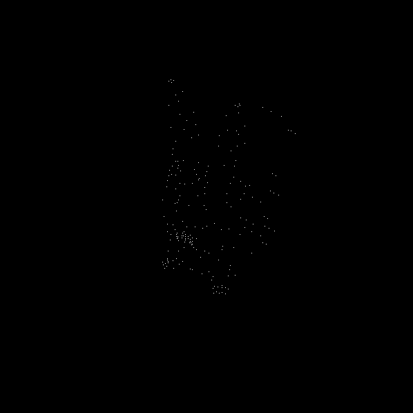
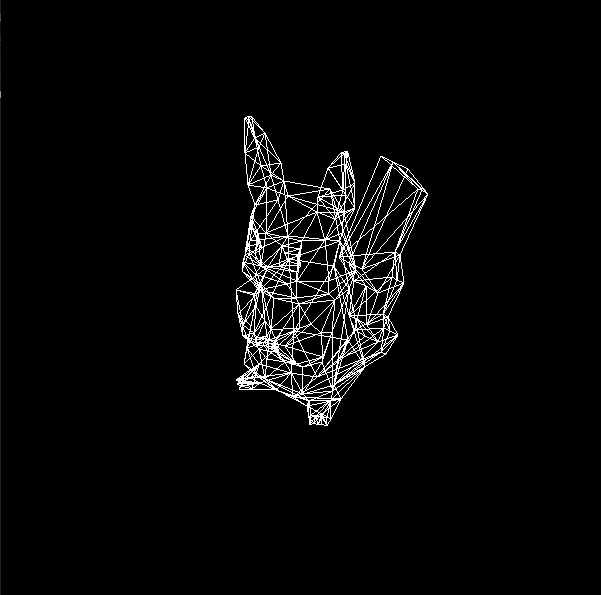
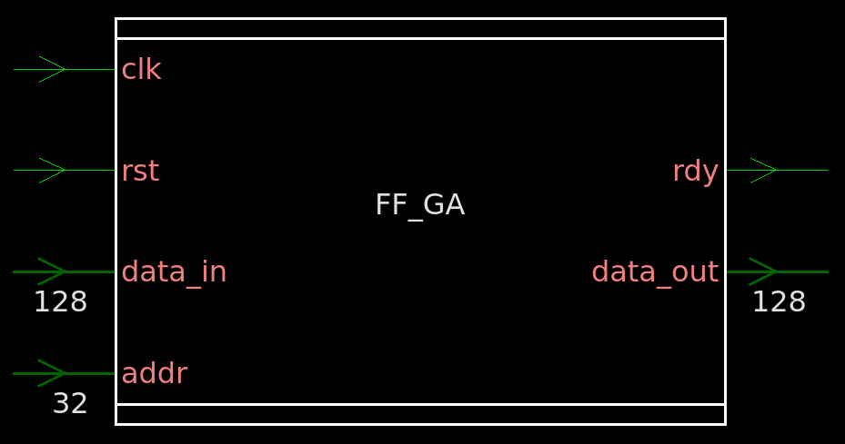
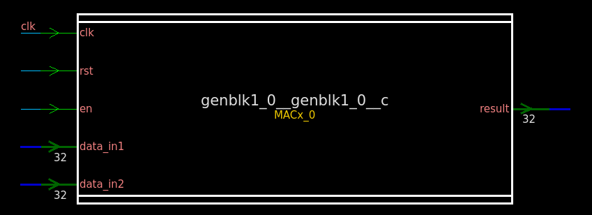

# FF_GA
4x4 Matrix Multiplier using System Verilog

### Design Description
The inspiration for this project was to accelerate 4x4 matrix operations which can represent any arbitrary 3D transformation.  
It is capable of supporting most legacy OpenGL transformation/projections with a the exception of perspective projection due to the division step.  

Has 4 states of operation:  
- Load Matrix - 5 cycles
  - Multiply input matrix with current saved internal matrix (4 cycles)
  - write result back to internal matrix (1 cycle)
- Process Vertex - 4 cycles
  - perform matrix multiplication of input with current interal matrix
  - No write back required, does not override internal matrix
- Read Result - 4 cycles
  - Can be performed after either Load / Process operation
  - Can only read out 1 column at a time
- Idle - 1 cycle minimum
  - Ready flag is set in this state
  - resets MACx array for next operation
  - automatically entered after a read result operation

It was synthesized using a 90nm standard cell library.

### Result Example
These result are not direct output by the testbench. The first image with only the dots is achieved by using effectively a put pixel command for each result from the testbench
which is the most direct representation of the output of the design. The second image does some extra work to draw output as triangles (see [stl_test](stl-test)).   
Equivalent OpenGL operations:    
```
glViewport(0,0,600,600)
glOrtho(-300, 300, -300, 300, 0, 10000)
glTranslate(0, 0, -1200)
glRotate(-60, 1, 0, 0)
glRotate(-60, 0, 0, 1)
glScale(5,5,5)
```
see [Render Testbench](src/render_test.sv)  

 

### Datapath Diagram


### Block Diagrams

 
